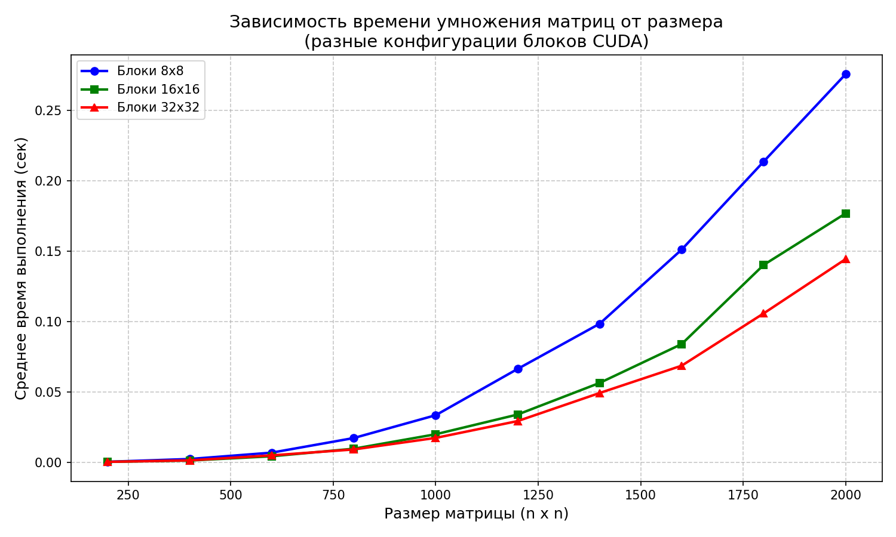
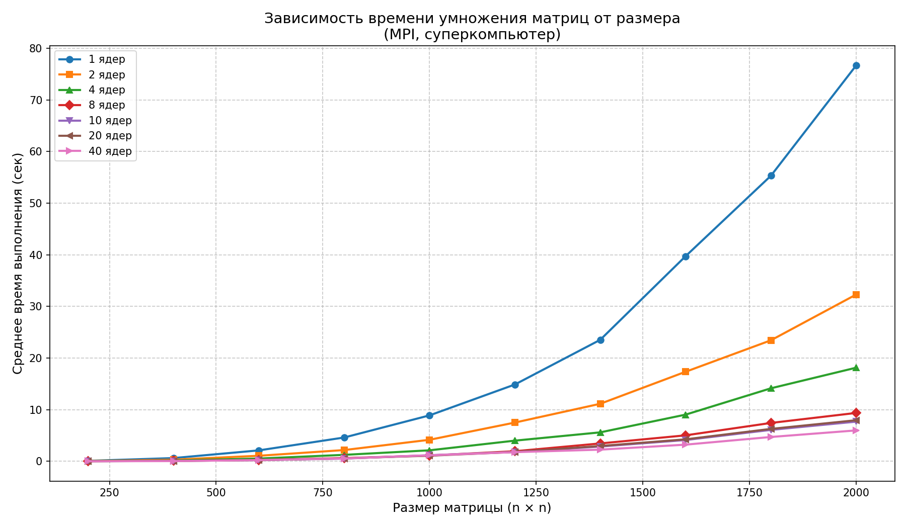

# Умножение квадратных матриц (C++ + Python верификация)

Программа на C++ умножает две квадратные матрицы, сохраняет результат в файл и выводит время выполнения.  
Скрипт на Python автоматизирует запуск, проверяет корректность умножения (через `numpy`) и собирает статистику времени для разных размеров матриц.

## Задача

- Перемножить две квадратные матрицы, заданные в текстовых файлах.
- Сохранить результат в файл.
- Вывести время выполнения.
- Автоматически верифицировать результат с помощью сторонней библиотеки (Python + NumPy).

