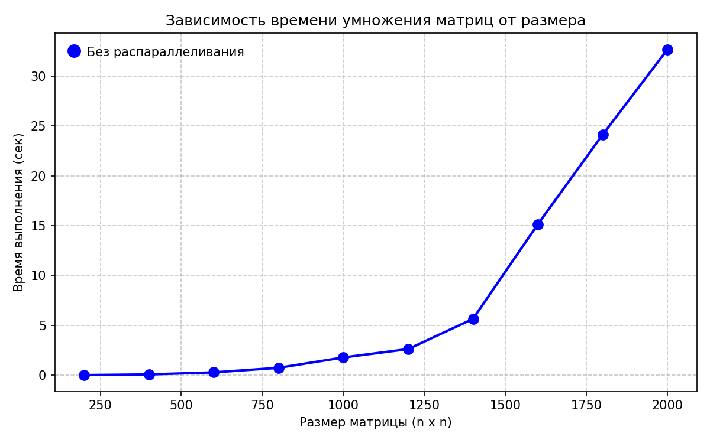
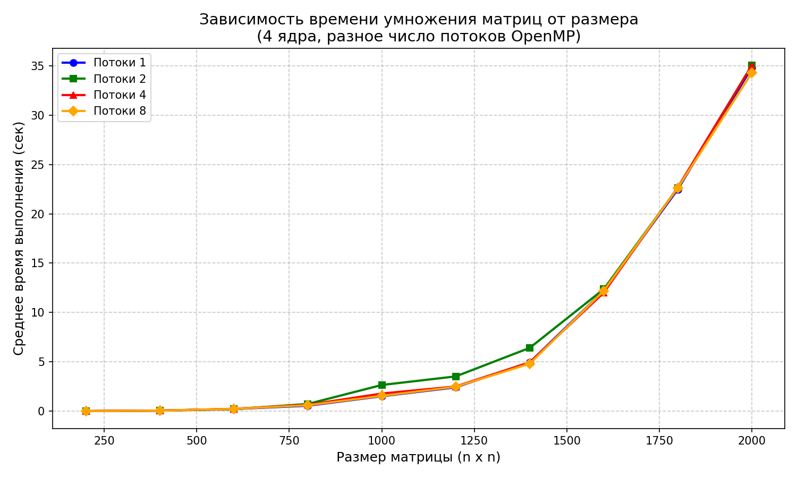

# Умножение квадратных матриц с использованием OpenMP (C++ + Python верификация)

Программа на C++ с технологией **OpenMP** умножает две квадратные матрицы, сохраняет результат в файл и выводит время выполнения.  
Скрипт на Python автоматизирует запуск с разным числом потоков, проверяет корректность умножения (через `numpy`) и собирает статистику времени для разных размеров матриц.

## Задача

- Реализовать параллельное умножение двух квадратных матриц с помощью OpenMP.
- Сохранить результат в файл.
- Измерить время выполнения для разного числа потоков (1, 2, 4, 8) и размеров матриц (200 – 2000).
- Автоматически верифицировать результат с помощью Python + NumPy.

## Ход работы

1. Написан C++ код (`lab2.cpp`) с использованием директивы  
   `#pragma omp parallel for collapse(2)` для распараллеливания внешних циклов умножения.

2. Для автоматизации экспериментов написан Python-скрипт `solve_verification_omp.py`, который:
   - Генерирует случайные матрицы заданного размера.
   - Устанавливает переменную окружения `OMP_NUM_THREADS` для управления числом потоков.
   - Запускает скомпилированную программу `Lab2.exe`.
   - Считывает время выполнения потока
   - Проверяет результат умножения с помощью `numpy` (сравнение с `np.array_equal`).

3. Эксперименты проведены для размеров матриц  
   200, 400, .., 1800, 2000 
   и числа потоков 1, 2, 4, 8.  
   Для каждого размера выполнено 10 прогонов, усреднённое время занесено в таблицу.

## Результаты

Ниже представлены средние времена выполнения (в секундах) для разных размеров матриц и числа потоков OpenMP.

| Размер матрицы | 1 поток | 2 потока | 4 потока | 8 потоков |
|-|-|-|-|-|
|200 * 200| 0.00426 | 0.00338 | 0.00249 | 0.00211 |
|400 * 400| 0.04901 | 0.04116 | 0.02690 | 0.01734 |
|600 * 600| 0.18979 | 0.15098 | 0.10080 | 0.06575 |
|800 * 800| 0.49107 | 0.42664 | 0.24140 | 0.16154 |
|1000 * 1000| 1.41982 | 1.18581 | 0.88040 | 0.95124 |
|1200 * 1200| 2.33809 | 2.10894 | 1.41204 | 1.68413 |
|1400 * 1400| 4.91578 | 4.93326 | 2.67599 | 2.87485 |
|1600 * 1600| 12.1610 | 9.77116 | 5.13731 | 4.86642 |
|1800 * 1800| 25.3218 | 16.7262 | 8.48686 | 7.15267 |
|2000 * 2000| 41.2795 | 23.2638 | 14.8429 | 10.7547 |

## Выводы

- При увеличении числа потоков с 1 до 4 наблюдается **ускорение** для всех размеров матриц (особенно для больших – 1600–2000).  
- Дальнейшее увеличение до 8 потоков на 4‑ядерном процессоре с гипертредингом даёт дополнительный прирост, но не линейный, из-за насыщения кэш-памяти и пропускной способности памяти.  
- Для самых маленьких матриц (200–400) накладные расходы на создание потоков могут нивелировать выгоду от параллелизации.  
- Максимальное ускорение (≈3,8×) достигнуто для матрицы 2000×2000 при переходе с 1 потока на 8 потоков.

## График зависимости времени от размера матрицы и числа потоков

