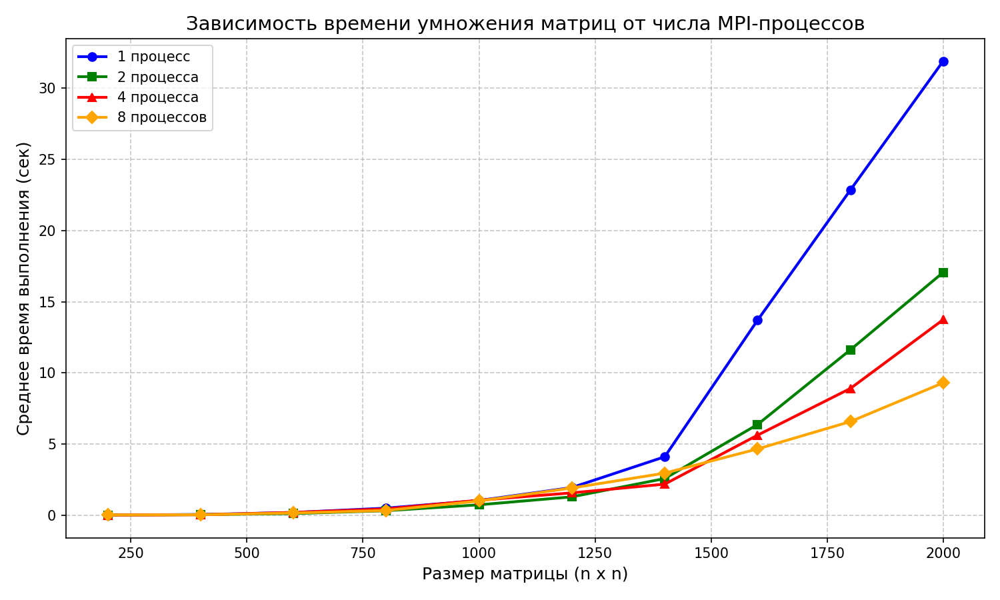

# Умножение квадратных матриц с использованием MPI (C++ + Python верификация)

Программа на C++ с технологией MPI (Message Passing Interface) умножает две квадратные матрицы, сохраняет результат в файл и выводит время выполнения.  
Скрипт на Python автоматизирует запуск с разным числом процессов, проверяет корректность умножения (через `numpy`) и собирает статистику времени для разных размеров матриц.

## Задача

- Реализовать параллельное умножение двух квадратных матриц с помощью MPI.
- Сохранить результат в файл.
- Измерить время выполнения для разного числа MPI-процессов (1, 2, 4, 8) и размеров матриц (200 – 2000).
- Автоматически верифицировать результат с помощью Python + NumPy.

## Ход работы

1. Написан C++ код `lab3.cpp`, который:
   - Читает матрицы `matrix_1.txt` и `matrix_2.txt` только на процессе с рангом 0.
   - Рассылает размер `n` всем процессам.
   - Рассылает всю матрицу `B` всем процессам.
   - Вычисляет количество строк, приходящихся на каждый процесс, с учётом возможного остатка.
   - Формирует массивы `sendcounts` и `displs` для `MPI_Scatterv`.
   - Замеряет время только вычислений с помощью `MPI_Wtime`, синхронизируя процессы через `MPI_Barrier` перед началом замера.
   - Каждый процесс выполняет умножение своей полосы строк `A` на всю матрицу `B`.
   - Собирает результат на процессе 0 через `MPI_Gatherv` и записывает в файл `result.txt`.
   - Выводит время выполнения в консоль.

2. Для автоматизации экспериментов написан Python-скрипт `solve_verification.py`, который:
   - Генерирует случайные матрицы заданного размера.
   - Запускает `mpiexec -n N lab3.exe` для нужного числа процессов.
   - Считывает время выполнения из вывода программы.
   - Проверяет результат умножения с помощью `numpy` (сравнение с `np.array_equal`).

3. Эксперименты проведены для размеров матриц  
   200, 400, .., 1800, 2000  
   и числа MPI-процессов 1, 2, 4, 8.  
   Для каждого размера выполнено 10 прогонов, усреднённое время занесено в таблицу.

## Выводы

- При увеличении числа процессов с 1 до 8 наблюдается ускорение для всех размеров матриц, особенно значительное для больших (≥ 1200).
- На 8 процессах для матрицы 2000*2000 достигнуто ускорение ≈3,4x по сравнению с одним процессом.
- Для маленьких матриц (200–400) накладные расходы на коммуникацию могут перевешивать выгоду от параллелизации (время на 8 процессах иногда больше, чем на 2).
- Распределение строк матрицы A и рассылка B – эффективная модель для умножения матриц, хорошо масштабирующаяся при достаточном размере задачи.

## Результаты

Ниже представлены средние времена выполнения (в секундах) для разных размеров матриц и числа MPI-процессов.

| Размер матрицы | 1 процесс | 2 процесса | 4 процесса | 8 процессов |
|-|-|-|-|-|
| 200 × 200 | 0.003627 | 0.002778 | 0.002265 | 0.005452 |
| 400 × 400 | 0.037810 | 0.029414 | 0.021760 | 0.026008 |
| 600 × 600 | 0.179304 | 0.106717 | 0.183038 | 0.145018 |
| 800 × 800 | 0.486926 | 0.304559 | 0.436567 | 0.321917 |
| 1000 × 1000 | 1.020855 | 0.721209 | 1.041746 | 0.989818 |
| 1200 × 1200 | 1.934665 | 1.279420 | 1.560613 | 1.903456 |
| 1400 × 1400 | 4.097375 | 2.564680 | 2.173719 | 2.945654 |
| 1600 × 1600 | 13.694000 | 6.364298 | 5.614272 | 4.647610 |
| 1800 × 1800 | 22.848260 | 11.615710 | 8.898211 | 6.569056 |
| 2000 × 2000 | 31.915790 | 17.061180 | 13.737000 | 9.296179 |

## График зависимости времени от размера матрицы и числа MPI-процессов

