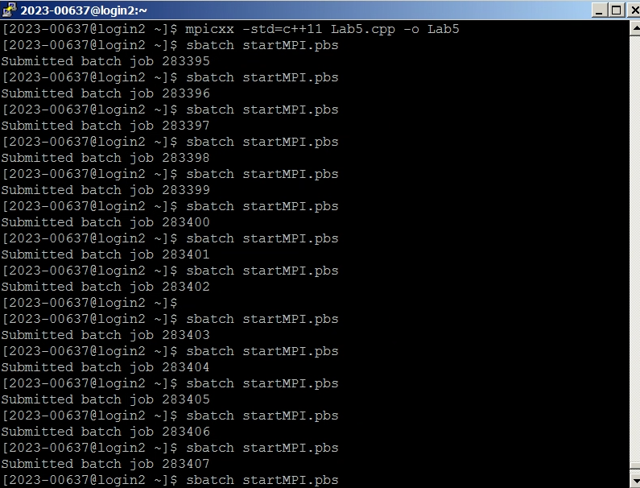
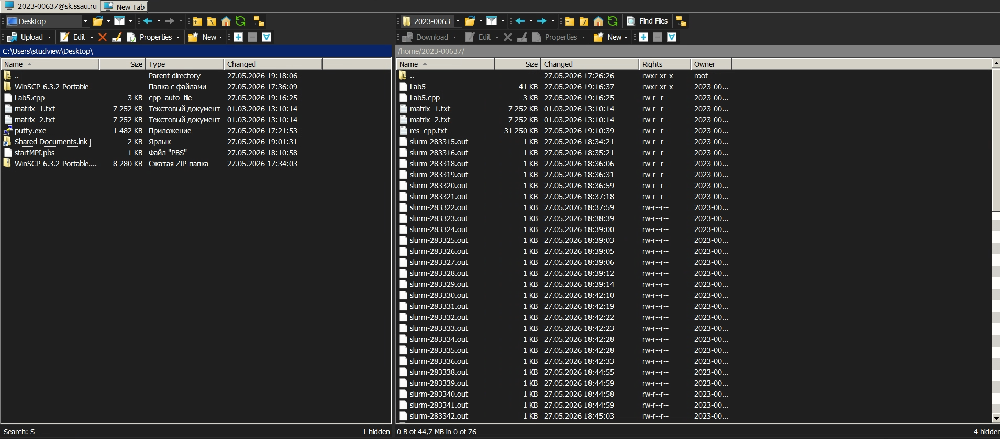
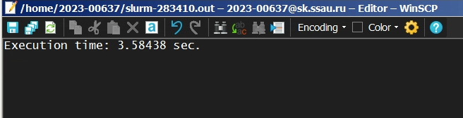

# Лабораторная работа №5. MPI на суперкомпьютере «Сергей Королёв»

## Задание

Параллельную версию программы на MPI (из лабораторной работы №3) необходимо запустить на суперкомпьютере «Сергей Королёв» и провести серию тестов с разным числом ядер и размерами матриц.

## Ход работы

В ходе лабораторной работы я запустил программу `lab5.cpp` на суперкомпьютере «Сергей Королёв».

1. Подключение – использовал PuTTY для доступа к терминалу и WinSCP для передачи файлов.
    
2. Подготовка файлов – разместил исходный код, скрипт запуска `startMPI.pbs`.
    
3. Компиляция – выполнялась командой `mpicxx -std=c++11 lab5.cpp -o lab5`
4. Запуск – поставил задачу в очередь PBS. Для каждого эксперимента задавалось разное количество MPI-процессов (1, 2, 4, 8, 10, 20, 40) и размеры матриц от 200 до 2000 с шагом 200.
5. Сбор результатов – программа записывала время выполнения в файл. Полученные данные приведены ниже.
    

## Краткое описание работы программы (lab5.cpp)

- Инициализация MPI, получение ранга и числа процессов (`MPI_Init`, `MPI_Comm_rank`, `MPI_Comm_size`).
- Процесс с рангом 0 читает матрицы из файлов `Source/matrix1.txt` и `Source/matrix2.txt` (или генерирует их на лету в Python‑скрипте).
- Размер матрицы `n` рассылается всем процессам через `MPI_Bcast`.
- Матрица `B` рассылается целиком через `MPI_Bcast`.
- Строки матрицы `A` распределяются между процессами (поровну, так как `n` кратно числу процессов) с помощью `MPI_Scatter`.
- Каждый процесс вычисляет свою часть произведения (`local_C`).
- Результаты собираются на процессе 0 через `MPI_Gather`.
- Процесс 0 записывает итоговую матрицу в `Source/res_cpp.txt` и выводит время выполнения.

## Результаты тестов

| Размер матрицы | 1 ядро | 2 ядра | 4 ядра | 8 ядер | 10 ядер | 20 ядер | 40 ядер |
|-|-|-|-|-|-|-|-|
| 200 x 200 | 0.07464| 0.03768| 0.01805| 0.00897| 0.00718 | 0.00359 | 0.00182 |
| 400 x 400 | 0.61215| 0.30586| 0.15361| 0.07666| 0.06112 | 0.05263 | 0.03263 |
| 600 x 600 | 2.10397| 1.05750| 0.52133| 0.26466| 0.21223 | 0.22027 | 0.22268 |
| 800 x 800 | 4.59834| 2.16611| 1.23721| 0.60728| 0.51395 | 0.55647 | 0.53546 |
| 1000 x 1000 | 8.88403| 4.15512| 2.11613| 1.10771| 1.16632 | 1.07597 | 1.14749 |
| 1200 x 1200 | 14.8645| 7.49185| 3.99071| 1.93688| 1.80000 | 1.79026 | 1.76106 |
| 1400 x 1400 | 23.5213| 11.1306| 5.59462| 3.44837| 2.84734 | 2.95315 | 2.24688 |
| 1600 x 1600 | 39.7173| 17.3320| 9.02834| 5.01680| 4.10738 | 4.24181 | 3.21334 |
| 1800 x 1800 | 55.3071| 23.4287| 14.1309| 7.41977| 6.07014 | 6.26475 | 4.69986 |
| 2000 x 2000 | 76.6990| 32.3044| 18.1265| 9.36220| 7.67239 | 7.94760 | 5.97469 |

## Графики

## Выводы

1. Масштабируемость: Увеличение числа MPI‑процессов ускоряет вычисления, особенно для матриц размером ≥ 1000. Ускорение при переходе от 1 до 40 ядер для матрицы 2000×2000 составляет ≈ 12,8x (с 76,7 с до 5,97 с).
2. Эффективность: Для маленьких матриц накладные расходы на коммуникацию становятся заметны – ускорение невелико, а при 20–40 ядрах время может даже возрастать (например, для 600×600 на 20 и 40 ядрах время больше, чем на 10 ядрах).
3. Практический навык: Получен опыт работы с суперкомпьютером «Сергей Королёв» – компиляция MPI‑программ, использование PBS, передача файлов, анализ производительности.

## Итоги

В ходе работы я успешно перенёс MPI‑программу на суперкомпьютерную платформу, провёл серию экспериментов и сопоставил результаты с локальными вычислениями. Это позволило оценить реальное масштабирование параллельных алгоритмов в условиях кластерной архитектуры.

